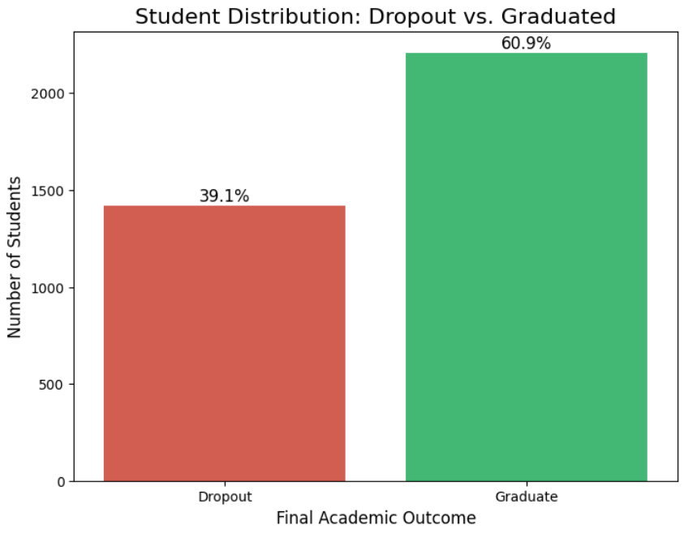
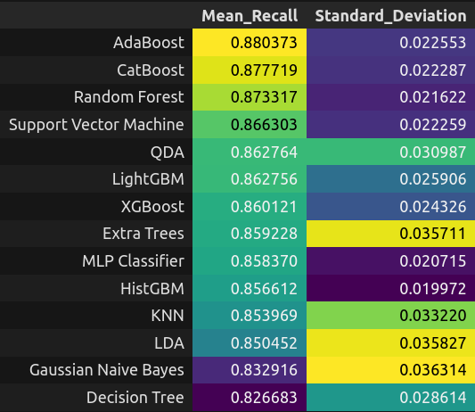
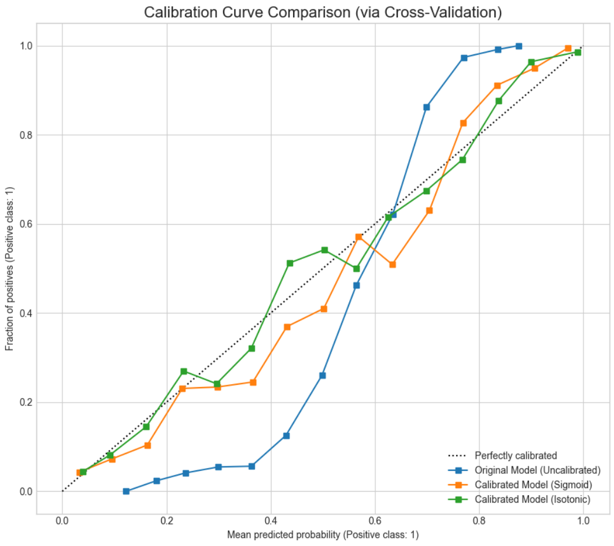
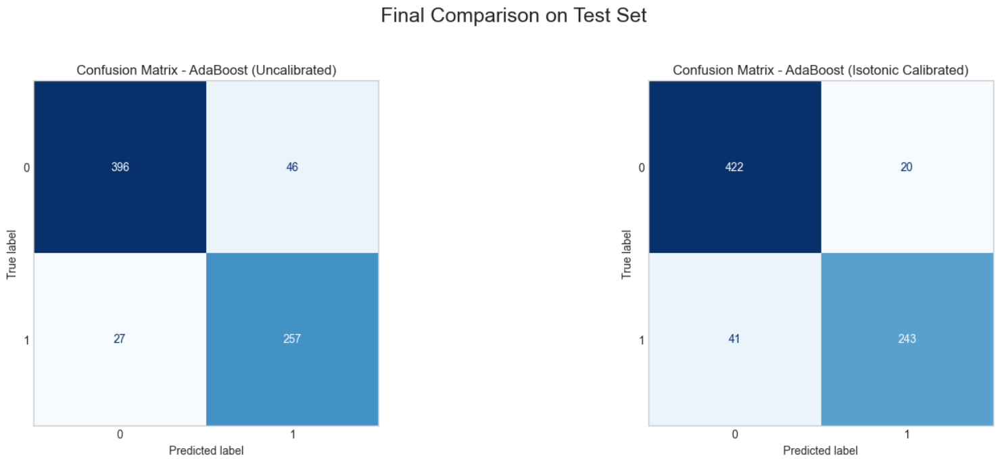
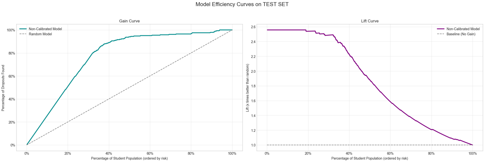
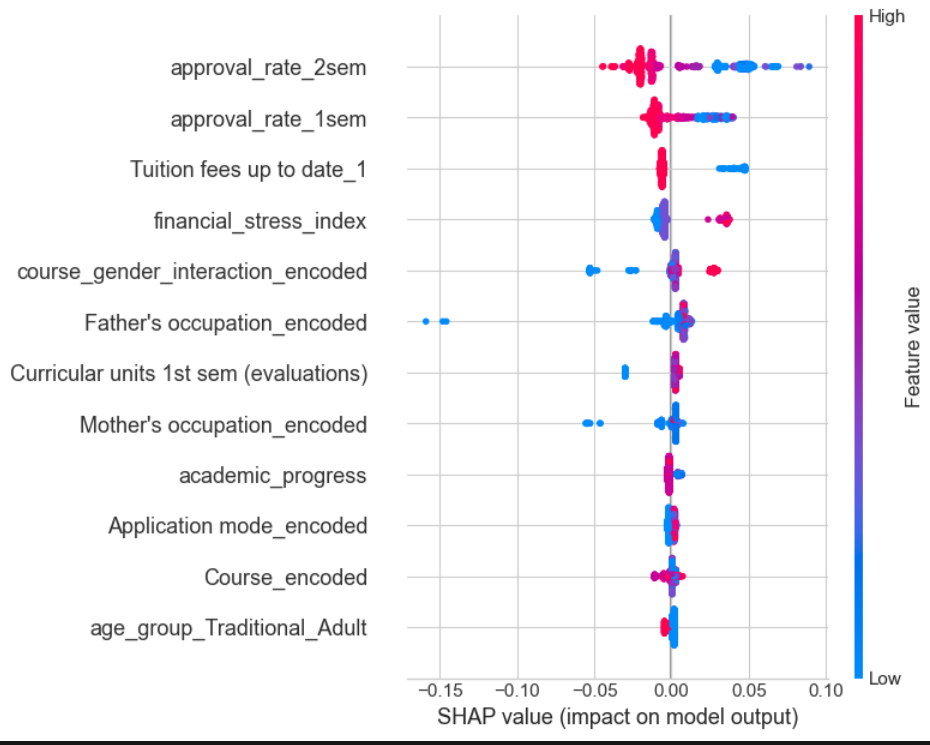

# School Dropout Prediction

This data science project aims to develop machine learning model capable of predicting student outcomes in higher education. By analyzing set of demographic, socio-economic, and academic performance data, the model classifies students into two primary categories: `Graduate` or `Dropout`. The dataset used for this analysis is public and was obtained from the Kaggle platform, available at the following link: [Predict students' dropout and academic success](https://www.kaggle.com/datasets/thedevastator/higher-education-predictors-of-student-retention).

The core challenge this project addresses is the high rate of student attrition, a significant issue for educational institutions worldwide. Early identification of students at risk of dropping out allows for timely and targeted interventions. The ultimate goal is to provide institutions with an analytical tool to proactively support their student body, thereby improving retention rates, fostering student success, and enhancing the institution's overall educational effectiveness. This predictive model serves as the foundation for a data-driven strategy to reduce academic evasion and ensure more students successfully complete their educational journey.

## Table of Contents

- [Business Problem](#business-problem)
- [Exploratory Data Analysis (EDA)](#exploratory-data-analysis-eda)
- [Model Selection and Optimization](#model-selection-and-optimization)
- [Final Model Evaluation](#final-model-performance-on-test-data)
    - [Model Calibration for Strategic Action](#final-model-calibration-for-strategic-action)
    - [Efficiency and Business Impact (Gain & Lift Curves)](#efficiency-and-business-impact-gain--lift-curves)
- [Model Explainability with SHAP](#explaining-the-why-model-interpretability-with-shap)
- [Conclusion](#conclusion)
- [How to Use](#how-to-use)

## Business Problem

Student dropout is a critical and multifaceted challenge for higher education institutions. It carries significant financial consequences, including loss of tuition revenue and inefficient allocation of resources. Beyond the financial impact, high attrition rates can damage an institution's reputation and academic standing. Most importantly, it represents a fundamental failure to support students in achieving their educational goals, which can have long-lasting negative effects on their career prospects and personal development.

The primary objective of this project is to move from a reactive to a proactive and data-driven approach to student retention. By creating a predictive model that accurately identifies students at high risk of dropping out, institutions can implement timely, personalized, and effective interventions. These can range from academic support like tutoring and mentorship, to financial aid counseling and mental health services. This model serves as a strategic asset, enabling institutions to not only boost their retention rates but also to foster a more supportive and successful learning environment for all students.

## Exploratory Data Analysis (EDA)

Before building the predictive model, a comprehensive exploratory data analysis (EDA) was conducted to uncover patterns, identify key relationships, and extract actionable insights from the dataset. This step is crucial for understanding the complex factors that influence student success and for guiding the subsequent feature engineering and modeling phases. As the initial distribution chart reveals, the dataset presents a moderate class imbalance, with approximately 61% of students graduating and 39% dropping out. This imbalance was a critical finding that directly shaped our strategy. To ensure the model could learn effectively from both classes, we applied targeted resampling techniques, such as ADASYN, during the modeling stage, with a focus on maximizing recall.



To ensure the robustness of our analysis and to scientifically inform the feature engineering process, a battery of statistical tests was employed. We utilized the Variance Inflation Factor (VIF) to detect multicollinearity among predictor variables, ensuring our model's stability. The relationship between categorical predictors and the student's final outcome was assessed using the Chi-Squared test, while ANOVA was used to compare the means of continuous variables across the 'Dropout' and 'Graduate' groups. For pairs of continuous variables, Pearson's correlation was calculated to measure the strength and direction of their linear relationship. Furthermore, a detailed analysis of outliers and skewness was performed on the data distributions. These rigorous statistical evaluations provided the necessary evidence to select the most impactful features, handle outliers appropriately, and apply necessary transformations, forming a solid, evidence-based foundation for the machine learning model.

### Model Selection And Optimization

The model selection process was meticulously designed to identify the most effective algorithm for predicting student dropout. A wide array of models was tested, ranging from linear models and support vector machines to more complex tree-based ensembles like Random Forest, XGBoost, and LightGBM.

Our primary evaluation metric was Recall. The choice to maximize recall is a strategic one rooted in the business problem: it is far more costly for the institution to fail to identify a student at risk (a false negative) than it is to mistakenly flag a stable student (a false positive). Maximizing recall ensures that our model catches the highest possible percentage of students who are genuinely at risk of dropping out, allowing for the broadest possible application of intervention programs.

To prepare the data for modeling and enhance performance, several key techniques were applied:

- **ADASYN (Adaptive Synthetic Sampling)**: This advanced oversampling technique was used to correct the inherent class imbalance in the dataset, creating synthetic data for the minority class (dropouts) to build a more balanced and robust model.

- **Logarithmic Transformations**: For features with skewed distributions, logarithmic transformations were applied to normalize them, improving the stability and performance of many machine learning algorithms.

- **Feature Engineering and Scaling**: New features were created based on insights from the EDA, and all numerical features were standardized to ensure they contributed equally to the model's predictions.

The models recall result was the following one:



---

In our pursuit of the best possible performance, we investigated the viability of creating a Stacking Ensemble. This involved analyzing the correlation matrix of the prediction errors from our top-performing models. The goal was to see if the models were making different types of errors, which would suggest that combining them could lead to a more powerful, generalized model. However, the results indicated that the stacking ensemble did not yield a significant improvement over the best-performing individual model.

The standout model was AdaBoost. To maximize its predictive power, we performed hyperparameter tuning using Bayesian Search, an efficient optimization technique that intelligently navigates the parameter space to find the optimal configuration. As a final refinement step, we leveraged SHAP (SHapley Additive exPlanations) values. In this context, SHAP was not used for interpretability, but rather as a sophisticated feature selection tool. By identifying and retaining only the features with the most significant impact on the AdaBoost model's output, we were able to reduce noise and further refine its performance, resulting in a lean, powerful, and highly accurate final model.

### Final Model: Calibration for Strategic Action

While our final AdaBoost model excels at classifying students, its raw probability scores were not reliable. To address this, we calibrated the model using Isotonic Regression, resulting in two distinct, strategic assets.

The calibration plot below shows the improvement. The original model (blue line) was poorly calibrated, while the calibrated model (orange line) aligns closely with the perfect calibration line (dashed), meaning its probability scores are trustworthy.



We offer two final models to serve different business needs:

- Uncalibrated Model (Optimized for Recall):
    - Purpose: To identify the maximum number of at-risk students for immediate, uniform intervention.
    - Use Case: Answers the question: "Which students should we act on?"

- Calibrated Model (Optimized for Reliable Probabilities):
    - Purpose: To accurately quantify the risk for each student, enabling strategic resource allocation and maximizing ROI.
    - Use Case: Answers the question: "How should we prioritize our efforts?" This allows for tiered interventions directing the most intensive resources to students with the highest probability of dropping out.

### Final Model Performance on Test Data

The final models were evaluated on a held-out test set to simulate real-world performance. The results highlight the strategic trade-offs between the two approaches.

| Metric / Feature                  | Non-Calibrated Model           | Calibrated Model (Isotonic)   |
|---------------------------------|-------------------------------|-------------------------------|
| Recall (Detection)               | **0.9049 (Superior)**          | 0.8556                        |
| Precision (Efficiency)           | 0.8482                        | **0.924 (Superior)**          |
| F1-Score (Balance)               | 0.8756                         | **0.8885 (Slightly Superior)**|
| Probability Reliability          | Low (Overconfident)            | **High (Realistic)**          |

---

#### Confusion Matrix

The confusion matrix for the non-calibrated model visually confirms its high detection rate (True Positives) on the test data.



---

#### Efficiency and Business Impact (Gain & Lift Curves)

The Gain and Lift curves demonstrate the model's immense practical value and efficiency.



Key Strategic Insights:

- **High Efficiency (Gain)**: By focusing interventions on just the top 40% of students identified by the model, an institution can effectively reach ~90% of all students who would eventually drop out.

- **Actionable Multiplier (Lift)**: The model is 2.5x more effective than random guessing. This means every action taken based on the model's list is significantly more likely to target a student genuinely in need, making retention efforts far more productive.

**Conclusion**: The model provides a clear, data-driven path for action. A manager can confidently decide to intervene with a specific cohort (e.g., the top 30%), knowing they will address a large portion (~80%) of the dropout problem, ensuring a high return on investment for their retention programs.

### Model explainability

Our analysis will follow a "What, How, and Why" narrative:

1. **What? (Global Importance Overview)**: First, we will use the Summary Plot (Beeswarm Plot) to answer: "Which features are, on average, the most important to the model on the test set?" This analysis also serves as a validation of our previous feature selection step, where we already used SHAP values on training data to refine the model. At that stage, features with a mean absolute importance below 0.002 were discarded, allowing us to build a simpler final model focused only on the strongest predictive signals and excluding possible noise. The following plot will therefore confirm if this hierarchy of importance holds on previously unseen data.



2. **How? (Dependence Analysis)**: Next, we will dive deep into the top features with the Dependence Plot. It will help us answer: "How exactly does an important feature (e.g., pass rate) influence dropout risk? Is the relationship linear? Is there an inflection point?"

3. **Why? (Individual Diagnosis)**: Finally, with the Waterfall Plot, we will diagnose an individual case. It will answer: "Why was a specific student classified as high risk?" by breaking down the prediction to understand exactly which factors contributed to the decision.

## Conclusion

Student dropout represents one of the greatest financial and reputational losses for an educational institution. This project developed an artificial intelligence solution that transforms the institution's approach from reactive to **proactive**, enabling the identification of at-risk students with high precision before it is too late. Our analysis proves that focusing on the highest-risk students identified by the model is **more than 2.5 times more efficient** than any random outreach strategy, drastically optimizing the support team's resources.

The final result offers two operational strategies, each with a clear benefit:

- **The "Maximum Reach" Model (Uncalibrated)**: This implementation is a powerful "safety net," capable of correctly identifying **9 out of 10 students** who are on a dropout trajectory. Its financial value lies in **maximizing revenue recovery**, by offering the greatest possible opportunity to retain students who would otherwise be lost.

- **The "Smart Efficiency" Model (Calibrated)**: This implementation not only predicts but **quantifies risk with high confidence**. Its financial value lies in **optimizing the ROI (Return on Investment)** of retention actions. With reliable probabilities, the institution can create intervention programs with varying costs, for example, high-cost tutoring for students with >80% risk and low-cost follow-up for students with 60% risk, ensuring every invested dollar is allocated with maximum efficiency.

Regardless of the chosen strategy, the impact is clear. By successfully predicting and retaining even a small fraction of students who would drop out, the system generates a return that can **surpass the investment in its creation within a single semester**. This solution is not just a forecasting tool; it is a strategic asset that protects the institution’s most valuable resource, its students, and directly strengthens its financial sustainability and market reputation.

## How to Use

To run this project on your local machine, follow the steps below:

1.  **Clone the repository:**
    ```bash
    git clone https://github.com/DiogoSoares3/School-Dropout.git
    cd School-Dropout
    ```

2.  **Install the dependencies:**
    You must have `uv` installed. If it is not installed, follow this [tutorial](https://docs.astral.sh/uv/getting-started/installation/).
    After this, run the following command:

    ```bash
    uv sync
    ```

3.  **Run the Jupyter Notebook:**
    Open the `main.ipynb` file in a Jupyter environment to explore the step-by-step analysis and modeling.

---